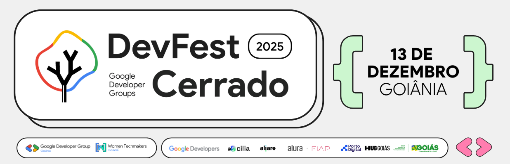

# DevFest Cerrado 2025 — Google Developer Groups 🤠

Material de referência e estudo da minha palestra para o **GDG DevFest Cerrado 2025**.

---

## 👾 Será que seu sistema é realmente seguro?

No dia **13 de Dezembro**, irei palestrar no [**DevFest Cerrado**](https://www.devfestcerrado.com.br/) do [**Google Developer Groups**](https://gdg.community.dev/) e vou colocar à prova seu conhecimento sobre segurança.

Vou trazer conteúdos que seriam complexos de verdade, de forma totalmente humana e acessível, mostrando na prática casos reais de vulnerabilidades e de segurança:

- [**OWASP API3**](https://owasp.org/API-Security/editions/2019/en/0xa3-excessive-data-exposure/): Excessive Data Exposure
- [**OWASP A04**](https://owasp.org/Top10/A04_2021-Insecure_Design/): Insecure Design
- [**CWE-602**](https://cwe.mitre.org/data/definitions/602.html): Client-Side Enforcement of Server-Side Security
- [**CWE-213**](https://cwe.mitre.org/data/definitions/213.html): Intentional Information Exposure
- [**CWE-200**](https://cwe.mitre.org/data/definitions/200.html): Exposure of Sensitive Information to an Unauthorized Actor
- [**CWE-639**](https://cwe.mitre.org/data/definitions/639.html): Authorization Bypass Through User-Controlled Key
- [**CWE-306**](https://cwe.mitre.org/data/definitions/306.html): Missing Authentication for Critical Function
- [**CWE-657**](https://cwe.mitre.org/data/definitions/657.html): Violation of Secure Design Principles

---

Enquanto a gente aprende, com teoria, boas práticas de segurança, um invasor compromete sistemas de verdade na vida real.

E esse assunto se faz ainda mais necessário na era da Inteligência Artificial, onde só gerar um _prompt_ como `“Crie um sistema sem falhas”`, não é o suficiente.

> [!NOTE]
>
> Vale lembrar que ensinar não é incentivar: conhecer o ataque é uma forma de defesa e aprender com casos reais, te prepara para o mundo real.

Então bora lá, já prepara aquela pergunta dahora pro final da palestra e vem fazer um networking de qualidade no dia **13 de Dezembro**, no [**DevFest Cerrado**](https://www.devfestcerrado.com.br/) **2025**!

---

## 🎙️ Palestra

### Do Código para o Mundo Real: O Ponto de Encontro entre Dados, Testes e Segurança

- Testar o funcionamento da nossa aplicação? Isso é fácil.
- Quebrar nossa aplicação antes do próprio usuário ou de um invasor? Essa é diferente.

Vamos desmistificar tudo que você conhece por desenvolvimento e entender como tornar nossa aplicação previsível contra o imprevisível.

Mais do que testar, você vai aprender a criar sistemas seguros (de verdade) e entender na prática o impacto da transformação dos dados da pior forma possível: através de invasões reais.

E se você acha que segurança é só sobre código, até a LGPD vai passar por aqui pela perspectiva de alguém que conseguiu acessar nosso banco de dados na íntegra.

Você vai perceber que testes não são uma tarefa a mais: eles fazem parte da nossa aplicação e são essenciais para a segurança digital e humana.

---

## 🎓 O que estudar?

Mesmo um sistema altamente protegido e sem vulnerabilidades dentro do código, pode ter vulnerabilidades arquiteturais e até mesmo comportamentais, sendo passíveis de engenharia reversa mesmo seguindo as melhores práticas do mercado.

Entender os riscos em profundidade nos permite criar aplicações seguras de forma efetiva e não somente seguir boas práticas, combinando o melhor do conhecimento teórico com a experiência prática.

### Termos e Tópicos

- **Exposição de Dados** _(inspeção, análise e interceptação de tráfego através do do próprio navegador)_
- **Engenharia Reversa** _(através da arquitetura da própria Web moderna em si)_
- **Downloads em Massa** _([**Google Cloud Storage**](https://cloud.google.com/storage), [**Azure Blob Storage**](https://azure.microsoft.com/pt-br/products/storage/blobs), [**Amazon S3**](https://aws.amazon.com/pt/s3/), [**Cloudflare R2**](https://www.cloudflare.com/pt-br/developer-platform/products/r2/), etc.)_

### Conceitos

- **Compliance**: é comum aprender como se prevenir de algo que não aconteceu ou até achar que esse é um tópico meramente burocrático, mas através das exigências da própria **LGPD**, a intenção é te mostrar não apenas como se proteger, mas como lidar com invasões que **já** ocorreram.

### Ferramentas de Destaque

- [**Google Antigravity**](https://antigravity.google/)
- [**Gemini 3 Pro**](https://gemini.google.com)

---

## 🔗 Links

- **Evento**
  - 🖥️ **Site:** https://www.devfestcerrado.com.br/
  - 🎟️ **Ingressos:** https://doity.com.br/dfc25
  - 📸 **Instagram:** https://www.instagram.com/gdg_goiania/
  - 💼 **LinkedIn:** https://www.linkedin.com/company/gdggoiania/
